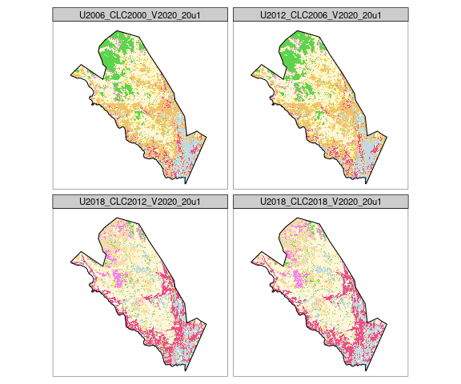

Corine Landcover
================
Micha Silver, Arnon Karnieli
29/03/2021

  - [Introduction](#introduction)
  - [Load data](#load-data)
  - [Clip Corine Landcover to site
    boundary](#clip-corine-landcover-to-site-boundary)
  - [Visualization](#visualization)

## Introduction

This script demonstrates “cookie cutting” of Corine landcover maps to
the boundary of chosen eLTER sites

### Libraries

Load required R libraries

``` r
pkg_list = c("terra", "sf", "tmap", "tmaptools", "OpenStreetMap", "dplyr")
installed_packages <- pkg_list %in% rownames(installed.packages())
if (any(installed_packages == FALSE)) {
  install.packages(pkg_list[!installed_packages], dependencies = TRUE)
}
# Packages loading
pkgs = lapply(pkg_list, library, character.only = TRUE)
```

### Define directories

This code chunk defines directories, and output location.

``` r
# Edit below as necessary: GIS, output directories
GIS_dir = "../GIS"
CLC_dir = file.path(GIS_dir, "CLC")

# Where to save outputs
Output_dir = "../Output"
if (!dir.exists(Output_dir)) {dir.create(Output_dir,
                                         recursive = TRUE)}

# (Add option to ignore Datum unknown warnings)
options("rgdal_show_exportToProj4_warnings"="none")
```

## Load data

Now load:

  - the Corine Landcover rasters: four versions, from 2000 to 2018;
  - the DEIMS boundaries shapefile: polygon dataset of eLTER sites
    (contains attribute columns for site name, location and country).

<!-- end list -->

``` r
deims_gpkg = file.path(GIS_dir, "DEIMS_sites.gpkg")
deims = read_sf(deims_gpkg, layer = "sites_eu")

clc_list = list.files(CLC_dir, pattern = ".tif$",
                      full.names = TRUE)

# Read in list of CLC files using terra package
clc = rast(clc_list)
# Reproject deims to match the Corine data
# ETRS 89 LAEA (European) coordinate system, EPSG 3035
deims = st_transform(deims, st_crs(clc))
```

## Clip Corine Landcover to site boundary

In this code chunk, a list of the EU countries is displayed to allow
user to choose her country. Using the chosen country name, a list of the
eLTER sites (from DEIMS: <https://deims.org/search/sites>) is prepared.
Then the `terra` package in R is used to read CLC rasters and two
functions, `crop()` and `mask()` are applied to cookie cut the raster to
each site boundary.

``` r
print(unique(deims$Country))
```

    ##  [1] "Sweden"           "Italy"            "United Kingdom"   "Germany"         
    ##  [5] "Spain"            "Switzerland"      "Czechia"          "Lithuania"       
    ##  [9] "Belgium"          "Portugal"         "Hungary"          "Bulgaria"        
    ## [13] "Romania"          "Austria"          "Poland"           "France"          
    ## [17] "Norway"           "Croatia"          "Latvia"           "Greece"          
    ## [21] "Serbia"           "Slovenia"         "Finland"          "Denmark"         
    ## [25] "Slovakia"         "Turkey"           "Netherlands"      "North Macedonia" 
    ## [29] "Ukraine"          "Poland, Slovakia"

``` r
### Enter country name here:
chosen_country = "Finland"

deims_country = deims[deims$Country == chosen_country,]
Country_dir = file.path(Output_dir, chosen_country)
if (!dir.exists(Country_dir)) {
  dir.create(Country_dir)
}
1
```

    ## [1] 1

``` r
# Now do cookie cutting for each site within chosen country
clc_cookiecut = lapply(1:nrow(deims_country), function(s) {
  site = deims_country[s,]
  
  # Prepare file name to save Clipped CLC
  tif_name = paste(site$Site, site$Location, site$Country, sep = "_")
  tif_name = tolower(tif_name)
  tif_name = gsub(pattern = " ", replacement = "_", x = tif_name)
  tif_name = gsub(pattern = "(", replacement = "", x = tif_name, fixed = TRUE)
  tif_name = gsub(pattern = ")", replacement = "", x = tif_name, fixed = TRUE)
  
  tif_path = file.path(Country_dir, paste0(tif_name, ".tif"))
  
  # Crop (and mask) CLC by site polygon and save to geotiff
  # This will be a multiband raster, with four bands:
  # 2000, 2006, 2012, 2018
  clc_cut = mask(crop(clc, site), vect(site),
                 filename = tif_path, overwrite = TRUE)
  
})
# Add site names to clc_cookiecut
names(clc_cookiecut) = deims_country$Site
```

## Visualization

To demonstyrate the result, plot the first eLTER site from the country
list.

``` r
tmap_mode("plot")
```

    ## tmap mode set to plotting

``` r
# Get raster stack and polygon boundary for one site
# Reproject to WGS84 for tmap
clc <- clc_cookiecut[[2]]
clc = project(clc, "epsg:4326")
site <- deims_country[2,]
site = st_transform(site, 4326)
# read OSM raster data
osm_site <- read_osm(st_bbox(site),
                    type = "esri-topo", ext=1.5)
tm_shape(osm_site) +
  tm_rgb() +
tm_shape(clc) + 
  tm_raster(palette = "RdYlGn",
            title = paste("CLC", site), alpha = 0.7) +
tm_shape(site) + 
  tm_borders("black", lwd = 1.5) +
tm_scale_bar(position = c("right", "bottom"))
```


