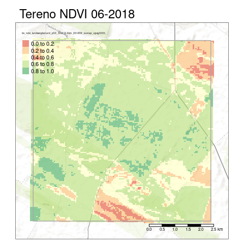

Acquiring OpenDataScience datasets
================
Micha Silver, Arnon Karnieli
28/02/2021

  - [Introduction](#introduction)
  - [Setup](#setup)
  - [Read all NDVI rasters](#read-all-ndvi-rasters)
  - [Visualize](#visualize)

## Introduction

This script demonstrates downloading and clipping high resolution (30 m
pixels) NDVI and Landcover datasets from:

<https://maps.opendatascience.eu/>

See:

<https://opengeohub.medium.com/europe-from-above-space-time-machine-learning-reveals-our-changing-environment-1b05cb7be520>

for details of how the datasets were prepared. This archive contains (as
of 2021) NDVI as quarterly averages covering 20 years, and landcover
(based on both Corine and Landsat) as monthly imagess, also covering 20
years.

The Tereno site is chosen as a small eLTER area to showcase this data.

## Setup

### Libraries

``` r
pkg_list = c("terra", "sf", "tmap", "tmaptools", "OpenStreetMap")
installed_packages <- pkg_list %in% rownames(installed.packages())
if (any(installed_packages == FALSE)) {
  install.packages(pkg_list[!installed_packages], dependencies = TRUE)
}
# Packages loading
pkgs = lapply(pkg_list, library, character.only = TRUE)
```

### Define directories

  - Directories
  - A list of all datasets available from OpenDataScience
  - Select only the NDVI datasets

<!-- end list -->

``` r
# Edit below as necessary: GIS, output, and figures directories
# and read options and sites files
GIS_dir = "../GIS"
if (!dir.exists(GIS_dir)) {dir.create(GIS_dir,
                                      recursive = TRUE)}

# Where to save outputs
Output_dir = "../Output"
if (!dir.exists(Output_dir)) {dir.create(Output_dir,
                                         recursive = TRUE)}

# List of available ODC rasters, with file names
# Download from: 
raster_list_url <- "https://gitlab.com/geoharmonizer_inea/eumap/-/raw/master/gh_raster_layers.csv?inline=false"
ODS_list_file = "gh_raster_layers.csv"
download.file(url = raster_list_url, destfile = ODS_list_file)
ODS_list = read.csv(ODS_list_file, sep = ";")

# Subset list of NDVI only
ODS_NDVI_list = ODS_list[grepl("ndvi",
                               ODS_list$name, fixed = TRUE),]

# (Add option to ignore Datum unknown warnings)
options("rgdal_show_exportToProj4_warnings"="none")
```

### Load only Tereno site polygon

Load only the Tereno polygon, and transform to the European CRS: ETRS89

``` r
tereno_gpkg = "Tereno.gpkg"
tereno_sf = read_sf(file.path(GIS_dir, tereno_gpkg))
# Transform to ETRS89 CRS to match OpenDataScience layers
tereno_sf_ETRS = st_transform(tereno_sf, 3035)
```

## Read all NDVI rasters

  - Read NDVI rasters for 20 years. The “/vsicurl/” virtual file system
    allows reading only the metadata, thus avoiding download of full
    (very large) datasets.
  - Thus the URL for download is constructed by concatenating:
      - “/vsicurl”
      - “<https://s3.eu-central-1.wasabisys.com/>” (the base URL)
      - “eumap/lcv/” (dataset group)
      - “lcv\_ndvi\_landsat.glad.ard\_p50\_30m\_0..0cm\_200003\_eumap\_epsg3035\_v1.0.tif”
        (the actual tif filename)
  - Crop to Tereno bounding box
  - Return a list of 3-month average NDVI for 20 years covering the
    eLTER site

<!-- end list -->

``` r
ODS_URL = "https://s3.eu-central-1.wasabisys.com/"

tereno_list = lapply(1:4, FUN = function(x){
#tereno_list = lapply(1:length(ODS_NDVI_list), FUN = function(x){
  folder = ODS_NDVI_list$folder[x]
  name = ODS_NDVI_list$name[x]
  url = paste0("/vsicurl/", ODS_URL, folder, "/", name)
  rast_ndvi = terra::rast(url)
  tereno_ndvi = crop(rast_ndvi, vect(tereno_sf_ETRS))
  #terena_ndvi = mask(tereno_ndvi, tereno_sf)
  return(tereno_ndvi)
})
```

## Visualize

Show two sample maps for 2020

``` r
tmap_mode("plot")
# read OSM raster data
osm_GER <- read_osm(st_bbox(tereno_sf),
                    type = "esri-topo", ext=1.2)
tm_shape(osm_GER) +
  tm_rgb() +
  tm_shape(tereno_list[[2]]) +
    tm_raster(palette = "RdYlGn", alpha = 0.6) +
  tm_shape(tereno_sf) +
    tm_borders(col="darkgrey", lwd = 1.5) +
  tm_layout(main.title = "Tereno NDVI - June 2020")
```

<!-- -->

``` r
tm_shape(osm_GER) +
  tm_rgb() +
  tm_shape(tereno_list[[4]]) +
    tm_raster(palette = "RdYlGn", alpha = 0.6) +
  tm_shape(tereno_sf) +
    tm_borders(col="darkgrey", lwd = 1.5) +
  tm_layout(main.title = "Tereno NDVI - Dec 2020")
```

<!-- -->
